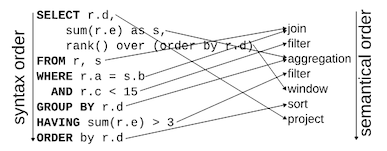

Wvlet, pronounced as weave-let, is a new cross-SQL flow-style query language for functional data modeling and interactive data exploration. Wvlet works with various types of SQL-based database engines, including [DuckDB](https://duckdb.org/), [Trino](https://trino.io/), [Hive](https://hive.apache.org/), etc.

- [Documentation](https://wvlet.org/wvlet/)


## Why Wvlet?

Wvlet queries (saved as .wv files) provide a natural way to describe data processing pipelines, which will eventually be compiled into a sequence of SQL queries. While SQL is a powerful language for processing data, its syntax often does not match the semantic order of data processing. Lets see the following example: The syntactic order of SQL's SELECT ... statements mismatches with the actual data flow inside the SQL engines (cited from _[A Critique of Modern SQL And A Proposal Towards A Simple and Expressive Query Language (CIDR '24)](https://www.cidrdb.org/cidr2024/papers/p48-neumann.pdf)_):



For overcoming this shortcoming of SQL, wvlet start from a table scan statement `from ...`, and the result can be streamlined to the next processing operators like `where`, `group by`, `select`, etc., as if passing table values through [a pipe](https://en.wikipedia.org/wiki/Pipeline_(Unix)) to the next operator: 

```sql
from (table)
where (filtering condition)
...
where (more filtering condition can be added)
group by (grouping keys, ...)
where (group condition can be added just with where)
select (columns to output)
order by (ordering columns...)
limit (limiting the number of output rows)
```

This flow style enables describing data processing pipelines with top-to-bottom semantic ordering. It allows various methods to help composing complex queries, such as adding an operator for debuging data in the middle of a query. This type of flow syntax has also been adopted in Google SQL, _[SQL Has Problems. We Can Fix Them: Pipe Syntax In SQL (VLDB 2024)](https://research.google/pubs/sql-has-problems-we-can-fix-them-pipe-syntax-in-sql/)_, to cope with the complexity of writing SQL queries.

