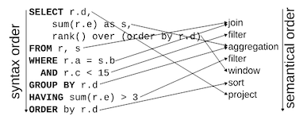
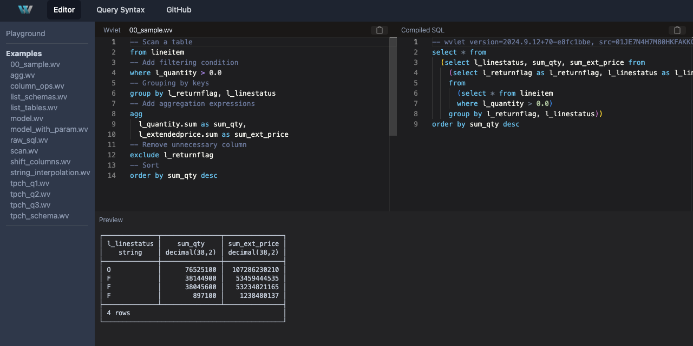

We are excited to announce the release of Wvlet version [2024.9](https://github.com/wvlet/wvlet/milestone/11), an open-source flow-style query language designed to help users to write efficient queries for SQL engines. You can try Wvlet, pronounced as _weave-let_, directly in your web browser at [Wvlet Playground](https://wvlet.org/wvlet/playground/). The source code of Wvlet compiler is available at [GitHub wvlet/wvlet](https://github.com/wvlet/wvlet).

<!-- truncate -->

## Why Wvlet?

At Treasure Data, we process over 3 million SQL queries daily. Managing this volume of queries while helping users (including LLM) write efficient queries presents significant challenges. 

The primary challenges lies in SQL's syntax: its syntactic order doesn't match the actual data flow. This mismatch makes debugging complex and deeply nested queries difficult, even for SQL experts. _[A Critique of Modern SQL And A Proposal Towards A Simple and Expressive Query Language (CIDR '24)](https://www.cidrdb.org/cidr2024/papers/p48-neumann.pdf)_ clearly illustrates this issue in this figure:

Additionally, the SQL standard (e.g., SQL-92) is limited in scope and lacks essential software engineering features for managing multiple queries. For example, in SQL, there are:
- No built-in support for reusing and generating queries.
- No extension point for multi-query optimization, such as incremental processing and pipeline execution like dbt.
- No built-in debugging or testing capabilities.

These limitations stem from SQL, born in the 1970s, which was not designed for today's complex data analytics needs. Wvlet addresses these challenges by modernizing [50-year-old SQL](https://dl.acm.org/doi/10.1145/3649887), making it more intuitive and functional while incorporating software engineering best practices.

## What's the current state of Wvlet?

Though still in early development, Wvlet already enables users to write and run queries against [DuckDB](https://duckdb.org/) and [Trino](https://trino.io/) through either a command line client (`wv`) or the Web-based UI (`wvlet ui`).

### Interactive Editor (wv)

If you are using Mac, you can easily install the [interative shell (wv)](/docs/usage/repl) with the Homebrew command: `brew install wvlet/wvlet/wvlet`.

The `wv` interactive editor (REPL) supports various shortcut keys, allowing you to check the schema (ctrl-j, ctrl-d), test the sub query (ctrl-j ctrl-t), or run the query (ctrl-j, ctrl-r) even in the middle of the query.

For using Trino SQL engine, you need to configure `~/.wvlet/profiles.yml` file to [specify the target Trino server address](/docs/usage/trino).

### Wvlet Playground 

Wvlet is written in Scala 3, which can be compiled to JavaScript using the power of [Scala.js](https://www.scala-js.org/), enabling browser-based execution. You can try out Wvlet queries in the [Wvlet Playground](https://wvlet.org/wvlet/playground/), where the Wvlet queries are compiled into SQL and run on [DUckDB's WebAssembly version (DuckDB Wasm)](https://duckdb.org/2021/10/29/duckdb-wasm.html)--all without requiring any installation.

- [Wvlet Playground](https://wvlet.org/wvlet/playground/)

Wvlet also provides a standalone [WebUI](/docs/usage/ui) to start a local web server to run Wvlet queries in your browser.

### Flow-Style Query Syntax

Wvlet has redesigned SQL in various ways to match the syntax with the natural data flow by introducing flow-style relational operators (e.g., `add`, `agg`, `concat`, `sample`, etc.), and column-at-a-time operators (e.g., `rename`, `exclude`, `shift`) for reducing the burden of enumerating columns. 

Notably, Wvlet enhances SQL with [test syntax](https://wvlet.org/wvlet/docs/syntax/test-syntax), leveraging test expressions to verify Wvlet's functionality through [Wvlet queries with test expressions](https://github.com/wvlet/wvlet/tree/main/spec/basic).

- [Wvlet - Quick Start](/docs/syntax/quick-start)
- [Query Syntax](/docs/syntax/)

For more details on the query syntax, refer to the following [presentation slides](https://speakerdeck.com/xerial/wvlet-a-new-flow-style-query-language-for-functional-data-modeling-and-interactive-data-analysis-trino-summit-2024) from [Trino Summit 2024](https://trino.io/blog/2024/12/18/trino-summit-2024-quick-recap.html):

<iframe class="speakerdeck-iframe" frameborder="0" src="https://speakerdeck.com/player/4148a46ee4f24fb0816d1207439cbd33?slide=10" title="Wvlet: A New Flow-Style Query Language For Functional Data Modeling and Interactive Data Analysis - Trino Summit 2024" allowfullscreen="true" style={{width: '100%', height: 'auto', aspectRatio: 1.777}} ></iframe>

### Functional Data Modeling

Queries written in Wvlet are reusable and composable, making it easier to manage complex queries. Once you write your query in .wv files, you can call or reuse them in other queries.

- [Data Models](/docs/syntax/data-models)

### Wvlet SDKs

We plan to add SDKs for multiple programming languages to enable users to convert Wvlet queries into SQL. Wvlet compiler, written in Scala 3, can be compiled into native LLVM code through [Scala Native](https://scala-native.org/en/stable/). This generates binaries that integrate with languages like Python, Rust, Ruby, C/C++ etc. Our 2024.9 release includes an initial version of Python SDKs: 

- [Wvlet SDKs](/docs/bindings)

Thanks to contributors from the community, we are getting closer to support multiple programming languages. For example, [an extension to use Wvlet using DuckDB](https://github.com/quackscience/duckdb-extension-wvlet), has been created. After the build pipeline is stabilized, we will release the official SDKs for various programming languages in PyPI, Maven, and other package repositories.

## What's Next?

We plan to release milestone versions approximately every 3 months, following the format `(year).(milestone month).(patch)`. The next milestone version will be [2025.1](https://github.com/wvlet/wvlet/milestone/12). You can find our project roadmap and features under active development on the [Wvlet Roadmap](https://github.com/orgs/wvlet/projects/2).

The next 2025.1 milestone will focus on functional data modeling features, including:
- Advanced query optimization with cascading updates and materialization of Wvlet data models, similar to [dbt](https://www.getdbt.com/), featuring incremental processing.
- Support for importing Wvlet queries from GitHub repositories. 
- Enhance the type system with improved dot-syntax support for complex expressions.
- Support for more SQL dialects through context-specific query inlining.

Join our discussions in the [Discord channel](https://discord.com/invite/vJBXRfEeNQ). We welcom your thoughts, feedback, and feature requests. 

