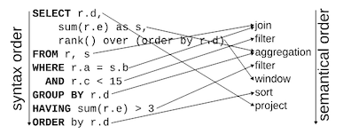
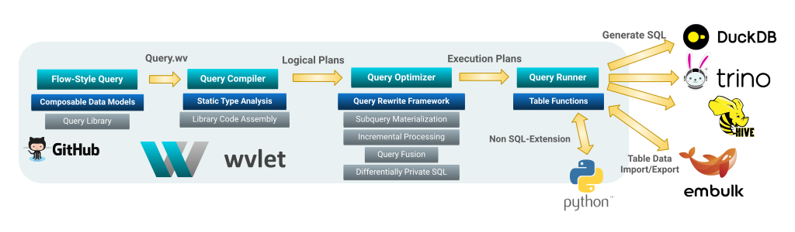

# Introduction

Wvlet (pronounced as weave-let) is a new flow-style query language designed for SQL-based database engines, such as [DuckDB](https://duckdb.org/) and [Trino](https://trino.io/).

## Documentation Overview

- [Installation](./usage/install)
- [Usage](./usage/install.md)
- [Query Syntax](./syntax/)
- [Language Bindings](./bindings/)
- [Development](./development/build.md)

## Why Wvlet?

Wvlet queries (saved as .wv files) provide an intuitive way to describe data processing pipelines. These pipelines are eventually compiled into SQL query sequences. 

### Traditional SQL Limitations

SQL's syntax often does not match the semantic order of data processing. Here is an example cited from _[A Critique of Modern SQL And A Proposal Towards A Simple and Expressive Query Language (CIDR '24)](https://www.cidrdb.org/cidr2024/papers/p48-neumann.pdf)_:

<center>

</center>


In SQL, the syntactic order of `SELECT ...` statements does not align with the actual data flow inside SQL engines.

Wvlet addresses this problem by starting queries with `from ...` (table scan statement), and then streamlining results through subsequent processing operators like `where`, `group by`, and `select`. This approach resembles passing table values through [a UNIX pipe](https://en.wikipedia.org/wiki/Pipeline_(Unix)):

```sql
-- Starts from table scan
from (table name)
where column = 'filtering condition'
...
where (Add more filtering conditions)
-- Grouping records by keys
group by key1, key2, ...
-- HAVING clause after group by
where (conditions for groups)
-- Specify columns to output
select c1, c2, ...
order by (ordering columns...)
```
This flow-style syntax allows for creating complex queries in a natural order and adding adding operators for testing or debugging data in the middle of the query. Google's SQL has also adopted this flow-style by introducing the pipe syntax to simplify writing SQL queries: _[SQL Has Problems. We Can Fix Them: Pipe Syntax In SQL (VLDB 2024)](https://research.google/pubs/sql-has-problems-we-can-fix-them-pipe-syntax-in-sql/)_.

### Modern SQL Challenges

The SQL standard (e.g., SQL-92) lacks essential features for managing multiple queries, such as:
- Reusing and generating queries
- Multi-query optimization, like incremental processing and pipeline execution
- Debugging or testing capabilities

SQL was not designed for today's complex data analytics needs. Wvlet modernizes the [50-year-old SQL](https://dl.acm.org/doi/10.1145/3649887), making it more intuitive and functional while incorporating software engineering best practices.

For more on Wvlet's motivation and design, see the presentation slides at Trino Summit 2024:

<center>
<iframe class="speakerdeck-iframe" frameborder="0" src="https://speakerdeck.com/player/4148a46ee4f24fb0816d1207439cbd33" title="Wvlet: A New Flow-Style Query Language For Functional Data Modeling and Interactive Data Analysis - Trino Summit 2024" allowfullscreen="true" style={{width: '98%', margin: '4px', height: 'auto', aspectRatio: 1.777}} ></iframe>
</center>

## Architecture

The Wvlet compiler processes `.wv` query files to generate logical plans, execution plans, and SQL statements. You can specify the directory to scan for .wv files with `-w (workdir)` option. Key terminlogies include:

- __Logical Plan__: Represents relational operators (e.g., scan, filter, projection) in a tree structure.
- __Execution Plan__: Steps to execute SQL and other programs, supporting various data sources and processing engines.
- [__Standard Library__](https://github.com/wvlet/wvlet/tree/main/wvlet-stdlib/module/standard): Provides common data type definitions with convenient operators while handling differences between SQL dialects.




## Features

### Flow-Style Query

Wvlet queries are written in a flow-style, allowing for a natural description of data processing pipelines. For more details, see the following documents:

- [Query Syntax](./syntax) 
- [Design Philosophy](./development/design)

Example Wvlet Query:
```sql
-- Starting with table scan
from lineitem
-- Filtering rows
where l_shipdate >= '1994-01-01'
-- Apply further filtering
where l_shipdate < '1995-01-01'
-- Grouping rows
group by l_shipmode
-- Processing grouped rows 
agg _.count as cnt

┌────────────┬──────┐
│ l_shipmode │ cnt  │
│   string   │ long │
├────────────┼──────┤
│ AIR        │ 1315 │
│ SHIP       │ 1394 │
│ FOB        │ 1382 │
│ REG AIR    │ 1313 │
│ RAIL       │ 1318 │
│ TRUCK      │ 1396 │
│ MAIL       │ 1366 │
├────────────┴──────┤
│ 7 rows            │
└───────────────────┘
```

### Column-Level Operators

Wvlet provides column-level operators to process selected columns efficiently. 

Example:
```sql
from lineitem
-- Add a new column
add l_quantity * l_extendedprice as revenue
-- Rename a column
rename l_shipdate as ship_date
-- Exclude a column
exclude l_comment
-- Reorder columns
shift l_orderkey, revenue
limit 5;

┌────────────┬───────────────┬──────────────┬──────────────┬────────────┬────────────┬─>
│ l_orderkey │    revenue    │ l_returnflag │ l_linestatus │ l_shipmode │ ship_date  │ >
│    long    │ decimal(18,4) │    string    │    string    │   string   │    date    │ >
├────────────┼───────────────┼──────────────┼──────────────┼────────────┼────────────┼─>
│          1 │   420075.9500 │ N            │ O            │ TRUCK      │ 1996-03-13 │ >
│          1 │  2040772.3200 │ N            │ O            │ MAIL       │ 1996-04-12 │ >
│          1 │    98408.3200 │ N            │ O            │ REG AIR    │ 1996-01-29 │ >
│          1 │   722863.6800 │ N            │ O            │ AIR        │ 1996-04-21 │ >
│          1 │   657354.2400 │ N            │ O            │ FOB        │ 1996-03-30 │ >
├────────────┴───────────────┴──────────────┴──────────────┴────────────┴────────────┴─>
│ 5 rows                                                                               >
└──────────────────────────────────────────────────────────────────────────────────────>
```

If you write the same query in SQL, all column names must be enumerated in each query stage:

```sql
select * from 
  (select l_orderkey, revenue, l_returnflag, l_linestatus, l_shipmode, ship_date, l_shipinstruct, l_quantity, l_tax, l_suppkey, l_receiptdate, l_linenumber, l_extendedprice, l_partkey, l_discount, l_commitdate from 
    (select l_orderkey, l_partkey, l_suppkey, l_linenumber, l_quantity, l_extendedprice, l_discount, l_tax, l_returnflag, l_linestatus, ship_date, l_commitdate, l_receiptdate, l_shipinstruct, l_shipmode, revenue from 
      (select l_orderkey, l_partkey, l_suppkey, l_linenumber, l_quantity, l_extendedprice, l_discount, l_tax, l_returnflag, l_linestatus, l_shipdate as ship_date, l_commitdate, l_receiptdate, l_shipinstruct, l_shipmode, l_comment, revenue from 
        (select *, l_quantity * l_extendedprice as revenue from lineitem))))
limit 5
```

### Chaining Function Calls

Wvlet supports dot-notation for chaining function calls.

Example:
```sql
from lineitem
group by l_shipmode
agg _.count, l_quantity.sum.round(0);

┌────────────┬──────────────┬───────────────────────────┐
│ l_shipmode │ count_star() │ round(sum(l_quantity), 0) │
│   string   │     long     │       decimal(38,0)       │
├────────────┼──────────────┼───────────────────────────┤
│ FOB        │         8641 │                    219565 │
│ SHIP       │         8482 │                    217969 │
│ TRUCK      │         8710 │                    223909 │
│ AIR        │         8491 │                    216331 │
│ REG AIR    │         8616 │                    219015 │
│ MAIL       │         8669 │                    221528 │
│ RAIL       │         8566 │                    217810 │
├────────────┴──────────────┴───────────────────────────┤
│ 7 rows                                                │
└───────────────────────────────────────────────────────┘
```

In SQL, every function call needs to be nested with parenthesises, which require more cursor and eye movements to write the query:
```sql
-- You need to wrap each function call with parentheses (More cursor movements!)
select l_shipmode, count(*), round(sum(l_quantity), 0);
from lineitem
group by l_shipmode
```

### Functional Data Modeling

Define reusable data model functions. 

Example: 
```sql
model lookup(person_id: int) =
  from persons
  where id = ${person_id}
end
```

Calling this model:
```sql
-- {person_id} will be replaced with the given input 1
select * from persons
where id = 1
```

Composing the model with another table:
```sql
from lookup(1) as p
join address_table 
  on p.id = address_table.person_id
```

### Managing Queries As A Reusable Module

:::warning
This feature will be available in 2025.
:::

Queries saved as `.wv` files can be managed in local folders or GitHub repositories as modules. Import and reuse queries in other queries. 

Example:
```sql
-- import queries from a GitHub repository
import github.com/my_project/my_query_library

-- Call a query from the imported module
from my_query(p1, p2, ...)
```

### Incremental Processing

:::warning
Incremental processing feature is planned to be available in 2025.
:::

Build reproducible data processing pipelines with incremental processing. 

Example:
```sql
@config(watermark_column='time', window_size='1h')
model weblog_records =
  from upstream_web_records
  select time, user_id, path,
end

-- Subscribe newly inserted records in weblog_records
-- and save filtered records to downstream_web_records
from weblog_records.subscribe()
where user_id is not null
append to downstream_web_records
```

This query compiles into SQL to update the downstream_web_records table:
```sql
create table if not exists as downstream_web_records;

insert into downstream_web_records
select time, user_id, path from upstrem_weblog_records
where
  -- incremental processing
  time > ${last_watermark}
  and time <= ${last_watermark} + interval '1 hour'
  -- the original filter to the subscribed data
  and user_id is not null;
```

If supported, modern table formats like Delta Lake and Iceberg are used for optimized processing.
