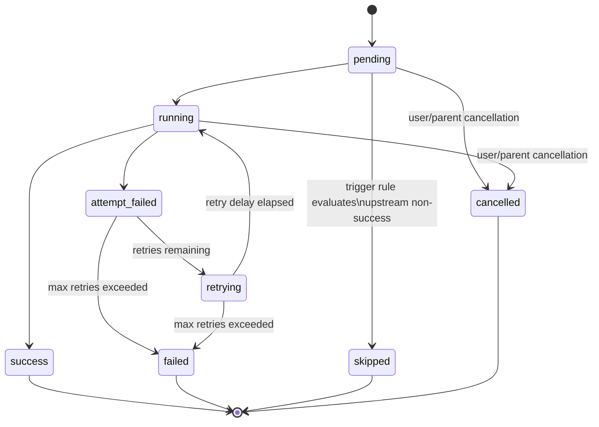

# Flow & Stage Syntax

Wvlet provides `flow` and `stage` constructs for defining data pipelines with orchestration capabilities such as retries, timeouts, scheduling, and error handling. Flows organize stages into directed acyclic graphs (DAGs) with explicit data and control dependencies.

## From Queries to Data Flows

| Construct | Purpose | Scope | Reusable |
|-----------|---------|-------|----------|
| `def` | Reusable function/logic | Module | Yes, callable |
| `model` | Reusable data artifact | Module | Yes, queryable |
| `flow` | Orchestration container | Module | Yes, triggerable |
| `stage` | Execution step in flow | Inside `flow` | No, flow-specific |

:::tip
`model` defines **what** data to produce (a reusable data artifact), while `stage` defines **when/how** to execute (an orchestration step with retries, triggers, etc.).
:::

## Quick Navigation

- [Flow Definition](#flow-definition)
- [Stage Definition](#stage-definition)
- [Configuration Blocks](#configuration-blocks)
- [Duration Literals](#duration-literals)
- [Stage Triggers](#stage-triggers)
- [Flow Dependencies](#flow-dependencies)
- [Flow Scheduling](#flow-scheduling)
- [Stage Execution Model](#stage-execution-model)
- [Complete Examples](#complete-examples)

## Flow Definition

A `flow` is an orchestration container that groups stages into a pipeline:

```wvlet
flow my_pipeline = {
  stage extract = from source | select *
  stage transform = from extract | where valid = true
  stage load = from transform | save to warehouse
}
```

### Flow with Parameters

Flows can accept parameters, similar to functions:

```wvlet
flow customer_pipeline(segment: string) = {
  stage entry = from users | where segment_id = segment
  stage output = from entry | select name, email
}
```

### Flow Grammar

```
flow <name> [(<params>)] [depends on <flow_name>] [if <flow_name>.<state>] [with { <config> }] = {
  <stage definitions>
}
```

## Stage Definition

A `stage` is an execution step within a flow. Each stage defines a data transformation using standard wvlet query operators:

```wvlet
flow my_pipeline = {
  stage extract = from 'data.csv'
  stage transform = from extract | where active = true | select name, email
  stage load = from transform | save to warehouse.customers
}
```

### Data Dependencies

Stages reference other stages via `from`, which creates an implicit success dependency. A stage runs only after its upstream stages succeed:

```wvlet
flow my_pipeline = {
  stage a = from source             -- runs immediately (literal source)
  stage b = from a | select *       -- runs when a succeeds
  stage c = from b | select *       -- runs when b succeeds
}
```

### Stage Grammar

```
stage <name> [if <trigger>] [with { <config> }] = <body>
```

## Configuration Blocks

Both flows and stages support `with { }` blocks for configuration. Configuration uses a `key: value` syntax with one item per line.

### Stage Configuration

```wvlet
flow data_pipeline = {
  stage extract with {
    retries: 3
    timeout: 5m
    retry_delay: 1s
    backoff: 'exponential'
  } = from api_source | fetch_data()

  stage load with {
    retries: 5
    timeout: 10m
    heartbeat: 30s
  } = from extract | save to warehouse
}
```

**Stage-level properties:**

| Property | Type | Default | Description |
|----------|------|---------|-------------|
| `retries` | Int | 0 | Max retry attempts |
| `timeout` | Duration | none | Start-to-close timeout |
| `retry_delay` | Duration | 1s | Initial retry delay |
| `backoff` | String | `'exponential'` | Backoff strategy (`'constant'`, `'linear'`, `'exponential'`) |
| `max_retry_delay` | Duration | none | Cap on backoff delay |
| `heartbeat` | Duration | none | Heartbeat interval for long-running stages |

### Flow Configuration

```wvlet
flow daily_etl with {
  schedule: cron('0 2 * * *')
  timezone: 'UTC'
  concurrency: 1
} = {
  stage extract = from source | select *
  stage transform = from extract | clean()
  stage load = from transform | save to warehouse
}
```

**Flow-level properties:**

| Property | Type | Description |
|----------|------|-------------|
| `schedule` | Schedule | Cron or interval schedule |
| `timezone` | String | Timezone for schedule evaluation |
| `concurrency` | Int | Max concurrent flow executions |
| `timeout` | Duration | Total flow timeout |

### Combining Parameters and Configuration

Flows can have both parameters and a configuration block:

```wvlet
flow parameterized_flow(segment: string) with {
  schedule: cron('0 0 * * *')
} = {
  stage entry = from users | where segment_id = segment
}
```

## Duration Literals

Wvlet supports typed duration literals for configuration values. A duration literal is an integer followed by a unit suffix:

| Unit | Suffix | Example |
|------|--------|---------|
| Milliseconds | `ms` | `100ms` |
| Seconds | `s` | `30s` |
| Minutes | `m` | `5m` |
| Hours | `h` | `2h` |
| Days | `d` | `1d` |

```wvlet
flow duration_example = {
  stage work with {
    timeout: 100ms
    retry_delay: 30s
    max_retry_delay: 5m
    heartbeat: 2h
  } = from source | select *
}
```

## Stage Triggers

By default, stages run when their upstream data sources succeed (implicit via `from`). You can override this behavior with `if` clauses to handle errors or perform cleanup.

### State Predicates

| Predicate | Meaning |
|-----------|---------|
| `A.failed` | Stage A failed after all retries |
| `A.done` | Stage A reached any terminal state (success, failed, skipped, or cancelled) |

### Error Handling

Use `if <stage>.failed` to define fallback stages that run when a stage fails:

```wvlet
flow resilient_pipeline = {
  stage primary with { retries: 3 } = from source
  stage fallback if primary.failed = from backup_source
}
```

### Cleanup

Use `if <stage>.done` to define stages that run regardless of success or failure:

```wvlet
flow pipeline_with_cleanup = {
  stage process = from source | transform()
  stage cleanup if process.done = from process | archive()
}
```

### Boolean Operators

Combine trigger conditions with `and` (higher precedence) and `or` (lower precedence). Use parentheses for explicit grouping:

```wvlet
flow complex_triggers = {
  stage a = from source
  stage b = from source
  stage c = from source

  -- Runs if either a or b fails
  stage alert if a.failed or b.failed = from source | select 'alert'

  -- Runs when both a and b are done
  stage summary if a.done and b.done = from source | select 'complete'

  -- Parentheses for explicit grouping
  stage d if a.failed or (b.done and c.done) = from source | select *
}
```

## Flow Dependencies

### Success Dependencies

Use `depends on` to create cross-flow dependencies. The dependent flow runs only after the upstream flow succeeds:

```wvlet
flow reporting depends on daily_etl = {
  stage generate = from warehouse | create_report()
  stage publish = from generate | upload_to_dashboard()
}
```

### Error and Cleanup Flows

Use `if <flow_name>.failed` or `if <flow_name>.done` for error handling and cleanup at the flow level:

```wvlet
-- Recovery flow: runs when daily_etl fails
flow recovery if daily_etl.failed = {
  stage alert = from source | select 'error'
  stage log = from source | log_failure()
}

-- Cleanup flow: runs when daily_etl finishes (any state)
flow cleanup if daily_etl.done = {
  stage archive = from logs | compress()
}
```

### Combined Schedule and Dependency

When both `depends on` and `schedule` are specified, the schedule determines **when** to check the dependency, and the dependency determines **if** the flow runs:

```wvlet
-- Runs at 3 AM, but only if ingestion has succeeded since last run
flow analytics depends on ingestion with {
  schedule: cron('0 3 * * *')
} = {
  stage analyze = from data | run_analytics()
}
```

## Flow Scheduling

Flows can be scheduled using cron expressions:

```wvlet
flow scheduled_flow with {
  schedule: cron('0 2 * * *')  -- 2 AM daily
  timezone: 'UTC'
  concurrency: 1               -- prevent overlapping runs
} = {
  stage extract = from source | select *
}
```

## Stage Execution Model

Each stage progresses through a well-defined state machine:



### State Reference

| State | Terminal | Description |
|-------|----------|-------------|
| `pending` | No | Waiting for upstream dependencies |
| `running` | No | Currently executing |
| `success` | Yes | Completed successfully |
| `attempt_failed` | No | Current attempt failed, will retry if attempts remain |
| `retrying` | No | Waiting for retry delay before next attempt |
| `failed` | Yes | All retry attempts exhausted |
| `skipped` | Yes | Bypassed due to trigger rule (upstream non-success) |
| `cancelled` | Yes | Stopped by user or parent flow |

### Trigger Evaluation

Triggers evaluate based on terminal states:

| Terminal State | `from A` (stage) | `depends on` (flow) | `if X.failed` | `if X.done` |
|----------------|------------------|---------------------|---------------|-------------|
| `success` | Runs | Runs | -- | Runs |
| `failed` | Skipped | Skipped | Runs | Runs |
| `skipped` | Skipped | Skipped | -- | Runs |
| `cancelled` | Skipped | Skipped | -- | Runs |

## Complete Examples

### ETL Pipeline with Error Handling

```wvlet
-- Reusable data models
model stg_customers = from source.customers | where valid = true
model stg_orders = from source.orders | where valid = true

-- Orchestrated pipeline with retries and error handling
flow daily_etl with {
  schedule: cron('0 2 * * *')
  timezone: 'UTC'
  concurrency: 1
} = {
  stage refresh_customers with {
    retries: 3
    timeout: 10m
    retry_delay: 30s
    backoff: 'exponential'
  } = from stg_customers | save to warehouse.customers

  stage refresh_orders with {
    retries: 3
    timeout: 10m
  } = from stg_orders | save to warehouse.orders

  -- Error handling
  stage alert if refresh_customers.failed or refresh_orders.failed =
    from source | select 'ETL stage failed'

  -- Cleanup runs regardless of outcome
  stage cleanup if refresh_customers.done and refresh_orders.done =
    from source | select 'cleanup complete'
}

-- Downstream reporting depends on ETL success
flow daily_reporting depends on daily_etl = {
  stage report = from warehouse | create_report()
}

-- Recovery flow handles ETL failure
flow etl_recovery if daily_etl.failed = {
  stage notify = from source | select 'ETL failed, manual intervention needed'
}
```

### Multi-Stage Pipeline with Fallback

```wvlet
flow resilient_pipeline = {
  -- Primary path with retries
  stage primary with {
    retries: 3
    timeout: 5m
  } = from primary_api | fetch_data()

  -- Fallback: runs only if primary fails
  stage fallback if primary.failed = from backup_api | fetch_data()

  -- Transform: runs when primary succeeds
  stage transform = from primary | normalize()

  -- Notify on completion
  stage notify if primary.done = from primary | select 'pipeline complete'
}
```
