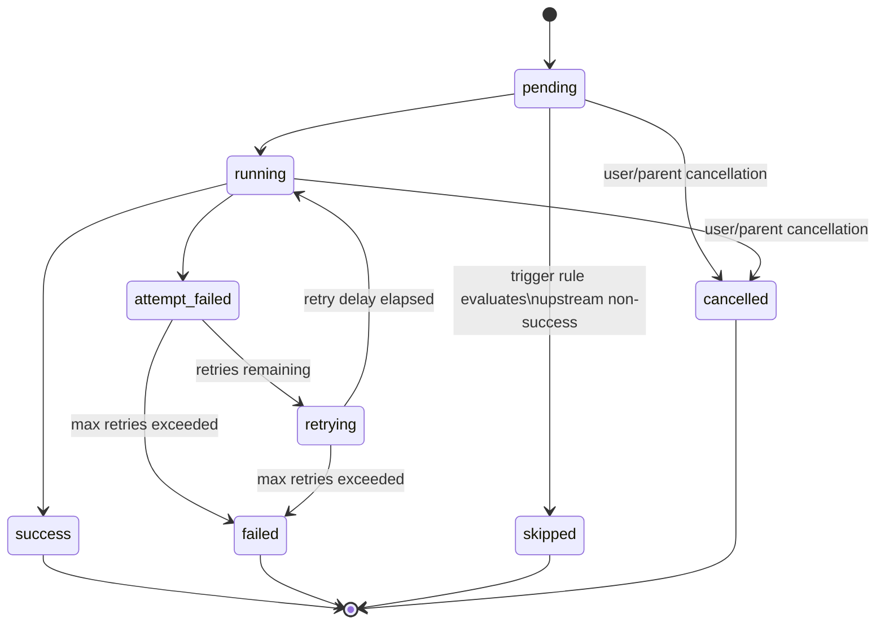

# Flow & Stage Syntax

Wvlet provides `flow` and `stage` constructs for defining data pipelines with orchestration capabilities such as retries, timeouts, scheduling, and error handling. Flows organize stages into directed acyclic graphs (DAGs) with explicit data and control dependencies.

## From Queries to Data Flows

| Construct | Purpose | Scope | Reusable |
|-----------|---------|-------|----------|
| `def` | Reusable function/logic | Module | Yes, callable |
| `model` | Reusable data artifact | Module | Yes, queryable |
| `flow` | Orchestration container | Module | Yes, triggerable |
| `stage` | Execution step in flow | Inside `flow` | No, flow-specific |

:::tip
`model` defines **what** data to produce (a reusable data artifact), while `stage` defines **when/how** to execute (an orchestration step with retries, triggers, etc.).
:::

## Quick Navigation

- [Flow Definition](#flow-definition)
- [Stage Definition](#stage-definition)
- [Configuration Blocks](#configuration-blocks)
- [Duration Literals](#duration-literals)
- [Stage Triggers](#stage-triggers)
- [Flow Operators](#flow-operators)
- [Flow Dependencies](#flow-dependencies)
- [Flow Scheduling](#flow-scheduling)
- [Running Flows](#running-flows)
- [Stage Execution Model](#stage-execution-model)
- [Complete Examples](#complete-examples)

## Flow Definition

A `flow` is an orchestration container that groups stages into a pipeline:

```wvlet
flow my_pipeline = {
  stage extract = from source | select *
  stage transform = from extract | where valid = true
  stage load = from transform | save to warehouse
}
```

### Flow with Parameters

Flows can accept parameters, similar to functions. A parameter can declare a default value,
which is used when no argument is bound at run time:

```wvlet
flow customer_pipeline(segment: string, min_score: int = 0) = {
  stage entry = from users | where segment_id = segment and score >= min_score
  stage output = from entry | select name, email
}
```

Arguments are bound when the flow is run, with the `run flow` statement or the
`wvlet flow run` CLI (see [Running Flows](#running-flows)):

```wvlet
run flow customer_pipeline(segment = 'premium')
```

Inside stage bodies, a parameter name shadows a column of the same name, so pick parameter
names that do not collide with the columns you query. Table and stage names (`from`, `merge`
sources, route targets, and `->` jump targets) are never treated as parameter references.

### Flow Grammar

```
flow <name> [(<params>)] [depends on <flow_name>] [if <flow_name>.<state>] [with { <config> }] = {
  <stage definitions>
}
```

## Stage Definition

A `stage` is an execution step within a flow. Each stage defines a data transformation using standard wvlet query operators:

```wvlet
flow my_pipeline = {
  stage extract = from 'data.csv'
  stage transform = from extract | where active = true | select name, email
  stage load = from transform | save to warehouse.customers
}
```

### Data Dependencies

Stages reference other stages via `from`, which creates an implicit success dependency. A stage runs only after its upstream stages succeed:

```wvlet
flow my_pipeline = {
  stage a = from source             -- runs immediately (literal source)
  stage b = from a | select *       -- runs when a succeeds
  stage c = from b | select *       -- runs when b succeeds
}
```

### Merging Stages

`merge` fans in multiple stages with union-all semantics. The merged stage runs after all of its sources succeed, and is skipped when any source fails:

```wvlet
flow my_pipeline = {
  stage source_a = from events_us | select user_id, event_time
  stage source_b = from events_eu | select user_id, event_time
  stage merged = merge source_a, source_b
  stage output = from merged | select user_id
}
```

Merge sources must be stages defined earlier in the same flow; referencing a plain table is a compile-time error. To include a regular table in a merge, wrap it in a stage first:

```wvlet
flow my_pipeline = {
  stage fresh = from [[1], [2]] as t(id)
  stage archived = from archive_table        -- wrap the table in a stage
  stage merged = merge fresh, archived
}
```

### Stage Grammar

```
stage <name> [if <trigger>] [with { <config> }] = <body>
```

## Configuration Blocks

Both flows and stages support `with { }` blocks for configuration. Configuration uses a `key: value` syntax with one item per line.

### Stage Configuration

```wvlet
flow data_pipeline = {
  stage extract with {
    retries: 3
    timeout: 5m
    retry_delay: 1s
    backoff: 'exponential'
  } = from api_source | fetch_data()

  stage load with {
    retries: 5
    timeout: 10m
    heartbeat: 30s
  } = from extract | save to warehouse
}
```

**Stage-level properties:**

| Property | Type | Default | Description |
|----------|------|---------|-------------|
| `retries` | Int | 0 | Max retry attempts |
| `timeout` | Duration | none | Start-to-close timeout |
| `retry_delay` | Duration | 1s | Initial retry delay |
| `backoff` | String | `'exponential'` | Backoff strategy (`'constant'`, `'linear'`, `'exponential'`) |
| `max_retry_delay` | Duration | none | Cap on backoff delay |
| `heartbeat` | Duration | none | Heartbeat interval for long-running stages |

### Flow Configuration

```wvlet
flow daily_etl with {
  schedule: cron('0 2 * * *')
  timezone: 'UTC'
  concurrency: 1
} = {
  stage extract = from source | select *
  stage transform = from extract | clean()
  stage load = from transform | save to warehouse
}
```

**Flow-level properties:**

| Property | Type | Description |
|----------|------|-------------|
| `schedule` | Schedule | Cron or interval schedule |
| `timezone` | String | Timezone for schedule evaluation |
| `concurrency` | Int | Max concurrent flow executions |
| `timeout` | Duration | Total flow timeout |
| `on_failure` | Activation | Notification hook fired when a run fails |
| `on_success` | Activation | Notification hook fired when a run succeeds |
| `on_finish` | Activation | Notification hook fired for both outcomes |
| `keep_runs` | Int | Retention cap: only the N most recent finished runs are kept |

### Run Notifications

The `on_failure:`, `on_success:`, and `on_finish:` hooks deliver a **run summary** — one row
per stage with `flow`, `run_id`, `stage`, `state`, `attempts`, and `error` columns — to an
[activation target](#delivering-results-with-activate) after the run reaches its terminal
state, so operators hear about failures without polling `wvlet flow session list`:

```wvlet
flow nightly_etl with {
  schedule: cron('0 2 * * *')
  on_failure: activate('webhook', url: 'https://alerts.example.com/wvlet')
} = {
  stage extract = from source | select *
  stage load = from extract | save to warehouse
}
```

The same targets as `activate` inside stages are available (`file`, `webhook`, and
custom-registered sinks). A hook that fails to deliver is logged and never changes the
result of the run.

### Combining Parameters and Configuration

Flows can have both parameters and a configuration block:

```wvlet
flow parameterized_flow(segment: string) with {
  schedule: cron('0 0 * * *')
} = {
  stage entry = from users | where segment_id = segment
}
```

## Duration Literals

Wvlet supports typed duration literals for configuration values. A duration literal is an integer followed by a unit suffix:

| Unit | Suffix | Example |
|------|--------|---------|
| Milliseconds | `ms` | `100ms` |
| Seconds | `s` | `30s` |
| Minutes | `m` | `5m` |
| Hours | `h` | `2h` |
| Days | `d` | `1d` |

```wvlet
flow duration_example = {
  stage work with {
    timeout: 100ms
    retry_delay: 30s
    max_retry_delay: 5m
    heartbeat: 2h
  } = from source | select *
}
```

## Stage Triggers

By default, stages run when their upstream data sources succeed (implicit via `from`). You can override this behavior with `if` clauses to handle errors or perform cleanup.

### State Predicates

| Predicate | Meaning |
|-----------|---------|
| `A.failed` | Stage A failed after all retries |
| `A.done` | Stage A reached any terminal state (success, failed, skipped, or cancelled) |

### Error Handling

Use `if <stage>.failed` to define fallback stages that run when a stage fails:

```wvlet
flow resilient_pipeline = {
  stage primary with { retries: 3 } = from source
  stage fallback if primary.failed = from backup_source
}
```

### Cleanup

Use `if <stage>.done` to define stages that run regardless of success or failure:

```wvlet
flow pipeline_with_cleanup = {
  stage process = from source | transform()
  stage cleanup if process.done = from process | archive()
}
```

### Boolean Operators

Combine trigger conditions with `and` (higher precedence) and `or` (lower precedence). Use parentheses for explicit grouping:

```wvlet
flow complex_triggers = {
  stage a = from source
  stage b = from source
  stage c = from source

  -- Runs if either a or b fails
  stage alert if a.failed or b.failed = from source | select 'alert'

  -- Runs when both a and b are done
  stage summary if a.done and b.done = from source | select 'complete'

  -- Parentheses for explicit grouping
  stage d if a.failed or (b.done and c.done) = from source | select *
}
```

## Flow Operators

Stage bodies can use flow operators in addition to regular query operators.

### Conditional Routing with route

`route` sends rows to different target stages based on conditions. Each target stage reads
the routing stage and receives only its matching rows. Cases follow first-match semantics
like a `case`/`when` expression: a row is routed to the first case whose condition holds,
and `else` receives the rows matching no case — so overlapping conditions never send a row
to more than one target. Targets may reference stages defined later in the flow:

```wvlet
flow conditional_flow = {
  stage check = from users | route {
    case _.age > 18 -> adult
    else -> minor
  }
  stage adult = from check | select name, 'adult' as category
  stage minor = from check | select name, 'minor' as category
}
```

A percentage-based form, `route by hash(user_id) { case 50 -> variant_a ... }`, splits rows
deterministically for A/B testing.

### Parallel Branches with fork

`fork` defines nested stages that run as parallel branches of the flow:

```wvlet
flow notification_flow = {
  stage entry = from users
  stage parallel = from entry | fork {
    stage email = from entry | activate('email')
    stage sms = from entry | activate('sms')
  }
}
```

### Delayed Execution with wait

`wait('<duration>')` delays the materialization of a stage:

```wvlet
stage delayed = from entry | wait('7 days')
```

### Event Sensors with wait until

`wait until <condition>` waits for an *event* instead of a fixed time: the stage polls its
input and proceeds once **at least one row satisfies the condition**. `_.column` in the
condition refers to a row of the input (the same convention as `route` cases). The sensor
only gates execution — it does not filter the rows the stage materializes.

```wvlet
flow load_orders = {
  stage landing = from landing_files | where table_name = 'orders'
  stage gate with {
    poll_interval: 30s     -- how often the condition is re-checked (default: 10s)
    timeout: 2h            -- give up like any other stage timeout
  } = from landing | wait until _.status = 'ready'
  stage load = from gate | save to orders
}
```

To wait on an aggregate condition, aggregate in the pipeline before the sensor:

```wvlet
stage gate = from new_events | select count(*) as cnt | wait until _.cnt > 1000
```

Polling respects the stage's `heartbeat:` config (a polling sensor is never mistaken for a
stalled attempt), and a `timeout:` expiry follows the stage's regular retry and failure
policy.

### Delivering Results with activate

`activate('<target>', param: value, ...)` delivers the materialized stage output to an
external target. Two sinks are built in:

- `activate('file', path: 'out.csv')` exports to a local file. The format comes from the
  path extension or a `format:` parameter (csv, parquet, or json). File export uses the
  engine's `COPY TO` statement and is available on DuckDB only; on other engines the stage
  fails with a clear error
- `activate('webhook', url: 'https://...')` posts the rows to an HTTP endpoint as a JSON
  array, or as newline-delimited JSON with `format: 'ndjson'`. At most `max_rows:` rows
  (1000 by default) are sent

A sink failure fails the stage attempt and follows the stage's retry policy; targets with no
registered sink log the delivery instead of failing. Custom sinks can be plugged in from
external modules via the Java ServiceLoader (`wvlet.lang.runner.ActivationSink`).

### Continuing in Another Flow with ->

`-> AnotherFlow` transfers control to another flow: when the jumping stage succeeds, the
target flow starts as a new run after the current flow completes. Jump chains stop at a
depth limit, so mutually referencing flows cannot loop forever:

```wvlet
flow main_flow = {
  stage check = from users | route {
    case _.active -> active_path
    else -> inactive_path
  }
  stage active_path = from check | activate('welcome')
  stage inactive_path = from check | -> RetentionFlow
}
```

### Explicit Termination with end

`end()` marks an explicit terminal stage and passes its input through unchanged:

```wvlet
stage done = from send | end()
```

## Flow Dependencies

### Success Dependencies

Use `depends on` to create cross-flow dependencies. The dependent flow runs only after the upstream flow succeeds:

```wvlet
flow reporting depends on daily_etl = {
  stage generate = from warehouse | create_report()
  stage publish = from generate | upload_to_dashboard()
}
```

### Error and Cleanup Flows

Use `if <flow_name>.failed` or `if <flow_name>.done` for error handling and cleanup at the flow level:

```wvlet
-- Recovery flow: runs when daily_etl fails
flow recovery if daily_etl.failed = {
  stage alert = from source | select 'error'
  stage log = from source | log_failure()
}

-- Cleanup flow: runs when daily_etl finishes (any state)
flow cleanup if daily_etl.done = {
  stage archive = from logs | compress()
}
```

### Combined Schedule and Dependency

When both `depends on` and `schedule` are specified, the schedule determines **when** to check the dependency, and the dependency determines **if** the flow runs:

```wvlet
-- Runs at 3 AM, but only if ingestion has succeeded since last run
flow analytics depends on ingestion with {
  schedule: cron('0 3 * * *')
} = {
  stage analyze = from data | run_analytics()
}
```

## Flow Scheduling

Flows can be scheduled using cron expressions:

```wvlet
flow scheduled_flow with {
  schedule: cron('0 2 * * *')  -- 2 AM daily
  timezone: 'UTC'
  concurrency: 1               -- prevent overlapping runs
} = {
  stage extract = from source | select *
}
```

Schedules are evaluated by the scheduler daemon:

```bash
wvlet flow scheduler -w <dir>
```

The daemon evaluates the five-field cron expression of every scheduled flow in the working
folder (in the flow's `timezone:`, defaulting to the system zone) and triggers due flows
through the regular flow executor, so cross-flow dependencies (`depends on`, `if X.failed`)
still decide whether a triggered run actually executes: the schedule determines *when* to
check, the dependency determines *if* the flow runs.

The daemon polls the `.wv` files of the working folder (every 5 seconds by default,
configurable with `--reload-interval <seconds>`, `0` disables it) and reloads the schedules
when they change, so flows can be added, removed, or rescheduled without restarting. Flows
whose schedule is unchanged keep their pending fire time across reloads; a compile error
keeps the previously loaded schedules.

Two flags cover scripting and missed windows:

- `--once`: evaluate the schedules once against the current minute, run the matching flows,
  and exit. Use this to drive wvlet schedules from an external scheduler such as system cron.
- `--catchup`: on startup, trigger every scheduled flow whose most recent fire time has no
  recorded run at or after it (e.g. the fire was missed while the daemon was down). The
  catch-up run binds the **missed** fire time as its `run_time`/`run_date` (see
  [Run Time](#run-time-run_time-and-run_date)), so the run computes the window it originally
  missed. Without this flag, missed windows are skipped silently. Combine with `--once` for a
  one-shot catch-up run.

`concurrency: N` is enforced through the run store whenever a flow starts (scheduler, CLI, or
`run flow`): a run atomically claims one of the flow's N slots and is recorded as `skipped`
when all slots are taken by running runs. With the `sqlite` run store the claim is
transactional across processes.

### Run Retention

Run records and their run-scoped `__wv_flow_*` tables accumulate until cleaned. Besides the
manual `wvlet flow session clean`, the scheduler sweeps them automatically — at startup and
every few minutes while the daemon runs — when a retention policy is set:

- `keep_runs: N` in a flow's config block keeps only the N most recent finished runs of that
  flow
- `wvlet flow scheduler --retention 7d` (also `12h`, `30m`) deletes finished runs older than
  the given age, across all flows

The sweep first marks crashed runs (running records whose liveness lease expired) as failed,
then deletes finished runs beyond the policy together with their tables. The most recent
finished run of each flow is always kept, because cross-flow dependencies (`depends on X`,
`if X.failed`) are evaluated against it.

```wvlet
flow hourly_metrics with {
  schedule: cron('0 * * * *')
  keep_runs: 24
} = { ... }
```

## Running Flows

Flow definitions are declarations: running a file that contains flows does not execute them.
Flows are triggered explicitly with the `run flow` statement or the `wvlet flow` CLI.

### Engine Support

Flows run on DuckDB (the default) and on Trino, selected with `--profile` like regular
queries. Stage materialization adapts to the engine automatically (e.g. Trino catalogs
without `create or replace table` get an explicit drop-and-create), and stage timeouts and
cancellation stop the running query server-side on both engines. Run-scoped
`__wv_flow_*` tables are created in the `catalog`/`schema` of the profile's default engine
connector, which must exist and be writable (for example a `memory` catalog schema on
Trino).

### run flow Statement

`run flow <name>` executes a flow and produces a **flow-run summary** relation with one row per
stage (`stage`, `state`, `attempts`, `error`). The summary can be piped through query operators
or verified with test statements:

```wvlet
flow my_pipeline = {
  stage src = from [[1, 'a'], [2, 'b']] as t(id, name)
  stage filtered = from src | where name = 'a'
}

run flow my_pipeline
| where state = 'success'
test _.size should be 2
```

Each successful stage is materialized as a run-scoped temporary table
(`__wv_flow_<run_id>_<stage>`), so stage names never collide with real tables and concurrent
runs do not interfere with each other.

#### Binding Flow Parameters

A parameterized flow is run by passing arguments in the flow call, positionally or by name.
Unbound parameters take their declared defaults; a missing required argument, an unknown
argument name, or a mistyped literal is reported before any stage executes:

```wvlet
flow customer_pipeline(segment: string, min_score: int = 0) = {
  stage entry = from users | where segment_id = segment and score >= min_score
  stage output = from entry | select name, email
}

run flow customer_pipeline(segment = 'premium', min_score = 50)
```

Flow identity is by name only: `concurrency:` limits and cross-flow dependencies
(`depends on X`, `if X.failed`) treat every run of a flow the same, regardless of the
arguments it was run with.

#### Run Time: run_time and run_date

Every run also binds two implicit values that stage bodies can reference like parameters:

- `run_time`: the logical time of the run as a timestamp
- `run_date`: the same time as a `'yyyy-MM-dd'` string

For scheduler-triggered runs, the logical time is the **schedule fire time** (a `--catchup`
run receives the fire time it missed, not the current time), so a daily flow can scope each
run to its own window:

```wvlet
flow daily_sales with { schedule: cron('0 2 * * *') } = {
  stage src = from sales | where sales_date = run_date
  stage report = from src | group by region | agg _.sum(amount)
}
```

Manual runs (`run flow`, `wvlet flow run`) bind the current time. A declared flow parameter
named `run_time` or `run_date` takes precedence over the implicit binding.

#### Backfill

`wvlet flow backfill` re-runs a scheduled flow once per schedule window in a date range,
binding each window's fire time as `run_time`/`run_date`:

```bash
# One run per day: 2026-07-01, 2026-07-02, ..., 2026-07-31
wvlet flow backfill daily_sales --from 2026-07-01 --to 2026-07-31 -w ./pipelines

# Arguments combine with windows; --to defaults to the current time
wvlet flow backfill "daily_sales(region = 'us')" --from 2026-07-01 -w ./pipelines
```

Windows run **sequentially in chronological order**, and the backfill stops at the first
failed run (later windows often depend on earlier ones); the printed message shows the
`--from` value to resume with after fixing the failure. The flow must declare a
`schedule: cron(...)` config, which defines the windows.

### wvlet flow CLI

Flows can be managed from the command line:

```bash
# List flows defined in the working folder
wvlet flow list -w ./pipelines

# Show the plan of a flow
wvlet flow show my_pipeline -w ./pipelines

# Run a flow and print its per-stage results (non-zero exit code when the flow fails)
wvlet flow run my_pipeline -w ./pipelines

# Run a parameterized flow with a flow call (the same syntax as the run flow statement)
wvlet flow run "customer_pipeline(segment = 'premium')" -w ./pipelines

# List recorded flow runs (most recent first)
wvlet flow session list -w ./pipelines

# Show the per-stage details of a recorded run
wvlet flow session show <run_id> -w ./pipelines
```

Every flow run is recorded in a local run store, updated live as stages change state. Two
store backends are available and can be selected with `--run-store <type>` (or the
`WVLET_FLOW_STORE` environment variable):

- `file` (default): one JSON file per run (`target/flow-runs/<run_id>.json`), no dependencies
- `sqlite`: a single SQLite database (`target/flow-runs/registry.db`) in WAL mode. Records are
  transactional across processes, which a scheduler daemon needs for enforcing flow-level
  `concurrency:` limits Cross-flow dependencies (`depends on X`,
`if X.failed`, `if X.done`) are evaluated against the latest recorded run of the referenced
flow: when the dependency is not satisfied, the flow run is recorded as `skipped` without
executing any stage.

Runs are managed with `wvlet flow session` subcommands:

- `wvlet flow session list` / `show <run_id>`: inspect recorded runs and per-stage states.
  `show` displays how the run was invoked — its flow call form with the resolved arguments
  (e.g. `customer_pipeline(segment = 'premium')`) and its logical `run_time` — so backfilled
  and parameterized runs stay auditable
- `wvlet flow session cancel <run_id>`: request cancellation of a running flow, even from
  another process. The executor polls the registry and stops in-flight stage attempts
  (cancelling their SQL statements server-side)
- `wvlet flow session resume <run_id>`: re-run a failed or cancelled run from its first
  non-successful stage, reusing the materialized tables of stages that already succeeded.
  The run's recorded arguments and `run_time`/`run_date` are re-bound automatically, so a
  parameterized or backfilled run resumes with exactly the values of its original invocation
- `wvlet flow session clean`: delete terminal run records and drop their run-scoped
  `__wv_flow_*` tables. With `--stale`, also remove running records whose liveness lease
  expired (crashed runs)

### Flow Runs in the Web UI

`wvlet ui -w <folder>` serves a read-only **Flow Runs** page next to the query editor:
recent runs with state badges, and per-run stage states, attempts, and errors. The page
reads the same run store as the `wvlet flow session` commands, so runs triggered from the
CLI or a scheduler daemon on the same working folder appear as they happen. Cancelling and
resuming runs stays in the CLI.

### Run Liveness Leases

While a flow runs, the executor periodically refreshes a liveness lease on its run record
(60 seconds by default). A record left in the `running` state by a crashed process stops
being refreshed, and once its lease expires the record is treated as failed everywhere it
is observed:

- it no longer occupies a `concurrency:` slot, so scheduled runs are not blocked forever
- cross-flow dependencies see it as failed (`if X.failed` recovery flows fire; `depends on X`
  stays unsatisfied)
- `wvlet flow session list` marks it as `running (stale)`, `session resume <run_id>` accepts
  it like a failed run, and `session clean --stale` removes it

## Stage Execution Model

:::info Implementation status
The flow executor fully implements this model: independent stages run in parallel on a DAG
scheduler, failed attempts retry with the configured backoff, and `timeout:` / `heartbeat:`
bound each attempt, cancelling a running SQL statement server-side on expiry. See
[Flow Operators](#flow-operators), [Flow Scheduling](#flow-scheduling), and
[Running Flows](#running-flows) for the features built on top of it.
:::

Each stage progresses through a well-defined state machine:


```mermaid
stateDiagram-v2
    [*] --> pending
    pending --> running
    pending --> skipped: trigger rule evaluates\nupstream non-success
    pending --> cancelled: user/parent cancellation

    running --> success
    running --> attempt_failed
    running --> cancelled: user/parent cancellation

    attempt_failed --> retrying: retries remaining
    retrying --> running: retry delay elapsed

    attempt_failed --> failed: max retries exceeded
    retrying --> failed: max retries exceeded

    success --> [*]
    failed --> [*]
    skipped --> [*]
    cancelled --> [*]
```

### State Reference

| State | Terminal | Description |
|-------|----------|-------------|
| `pending` | No | Waiting for upstream dependencies |
| `running` | No | Currently executing |
| `success` | Yes | Completed successfully |
| `attempt_failed` | No | Current attempt failed, will retry if attempts remain |
| `retrying` | No | Waiting for retry delay before next attempt |
| `failed` | Yes | All retry attempts exhausted |
| `skipped` | Yes | Bypassed due to trigger rule (upstream non-success) |
| `cancelled` | Yes | Stopped by user or parent flow |

### Trigger Evaluation

Triggers evaluate based on terminal states:

| Terminal State | `from A` (stage) | `depends on` (flow) | `if X.failed` | `if X.done` |
|----------------|------------------|---------------------|---------------|-------------|
| `success` | Runs | Runs | -- | Runs |
| `failed` | Skipped | Skipped | Runs | Runs |
| `skipped` | Skipped | Skipped | -- | Runs |
| `cancelled` | Skipped | Skipped | -- | Runs |

## Complete Examples

### ETL Pipeline with Error Handling

```wvlet
-- Reusable data models
model stg_customers = from source.customers | where valid = true
model stg_orders = from source.orders | where valid = true

-- Orchestrated pipeline with retries and error handling
flow daily_etl with {
  schedule: cron('0 2 * * *')
  timezone: 'UTC'
  concurrency: 1
} = {
  stage refresh_customers with {
    retries: 3
    timeout: 10m
    retry_delay: 30s
    backoff: 'exponential'
  } = from stg_customers | save to warehouse.customers

  stage refresh_orders with {
    retries: 3
    timeout: 10m
  } = from stg_orders | save to warehouse.orders

  -- Error handling
  stage alert if refresh_customers.failed or refresh_orders.failed =
    from source | select 'ETL stage failed'

  -- Cleanup runs regardless of outcome
  stage cleanup if refresh_customers.done and refresh_orders.done =
    from source | select 'cleanup complete'
}

-- Downstream reporting depends on ETL success
flow daily_reporting depends on daily_etl = {
  stage report = from warehouse | create_report()
}

-- Recovery flow handles ETL failure
flow etl_recovery if daily_etl.failed = {
  stage notify = from source | select 'ETL failed, manual intervention needed'
}
```

### Multi-Stage Pipeline with Fallback

```wvlet
flow resilient_pipeline = {
  -- Primary path with retries
  stage primary with {
    retries: 3
    timeout: 5m
  } = from primary_api | fetch_data()

  -- Fallback: runs only if primary fails
  stage fallback if primary.failed = from backup_api | fetch_data()

  -- Transform: runs when primary succeeds
  stage transform = from primary | normalize()

  -- Notify on completion
  stage notify if primary.done = from primary | select 'pipeline complete'
}
```
