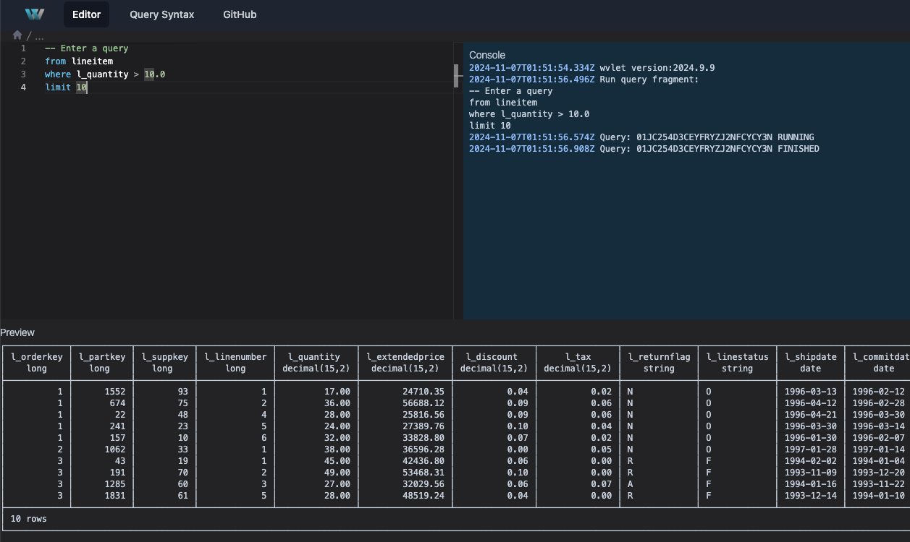

# Web UI (wvlet ui)

You can start a web-based query editor by running `wvlet ui` command. This will start a web server on `http://localhost:9090` where you can write and execute Wvlet queries. 

For starting the Web UI with a sample TPC-H dataset, run `wvlet ui` with `--tpch` option:

```bash
$ wvlet ui --tpch
```

This command will open a web browser for editing Wvlet queries. 



## Usage 

```bash
$ wvlet ui --help
usage: ui
  Start a local WebUI server

[global options]
 -h, --help             Display help message
 --debug                Enable debug log
 -l [LOGLEVEL]          log level
 -L [LOGLEVELPATTERNS]  log level for a class pattern
[options]
 -p, --port:[PORT]    Web UI server port. default:9090
 -w [WORKDIR]         Working directory
 --profile:[PROFILE]  Profile to use
 --catalog:[CATALOG]  Context database catalog to use
 --schema:[SCHEMA]    Context database schema to use
 --quit-immediately   Quit the server immediately after starting. Only for boot testing
 --tpch               Load a small demo TPC-H data (DuckDB only)```
```

## Shortcut Keys

- `ctrl-enter`: Execute the sub query at the current line
- `shift-enter`: Describe the schema at the line
- `⌘-enter`: Run the current query
- `⌘-shift-enter`: Run the current query with production mode (e.g., skip debug/test expressions)
