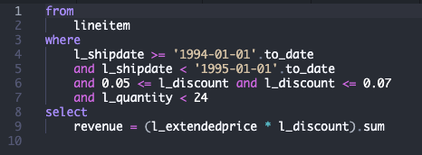

# VS Code Extension

The Wvlet extension provides syntax highlighting and language support for `.wv` files in Visual Studio Code.

## Installation

Install from the [VS Code Marketplace](https://marketplace.visualstudio.com/items?itemName=wvlet.wvlet) or search for "Wvlet" in VS Code's Extensions view.

## Features

- **Syntax Highlighting**: Full support for Wvlet keywords, operators, and syntax
- **Bracket Matching**: Automatic matching for `{}`, `[]`, `()`, and `${}`
- **Comment Support**: Single-line (`--`) and multi-line (`---`) comments
- **String Interpolation**: Highlighting for `${...}` expressions
- **Auto-closing**: Brackets and quotes automatically close when typed

## Example

## Pre-release Versions

To try new features early, switch to the pre-release version from the extension's settings in VS Code.

## Links

- [VS Code Marketplace](https://marketplace.visualstudio.com/items?itemName=wvlet.wvlet)
- [Report Issues](https://github.com/wvlet/wvlet/issues)