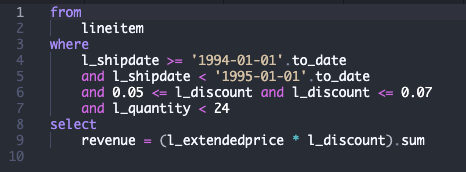

# VS Code Extension

The Wvlet extension provides syntax highlighting and language support for `.wv` files in Visual Studio Code.

## Installation

Install from the [VS Code Marketplace](https://marketplace.visualstudio.com/items?itemName=wvlet.wvlet) or search for "Wvlet" in VS Code's Extensions view.

## Features

- **Syntax Highlighting**: Full support for Wvlet keywords, operators, and syntax
- **Bracket Matching**: Automatic matching for `{}`, `[]`, `()`, and `${}`
- **Comment Support**: Single-line (`--`) and multi-line (`---`) comments
- **String Interpolation**: Highlighting for `${...}` expressions
- **Auto-closing**: Brackets and quotes automatically close when typed
- **Diagnostics**: Compilation errors are reported inline as you edit
- **Document Outline**: Models, types, vals, and flows appear in the outline view
- **Code Completion**: Context-aware suggestions as you type

## Code Completion

The extension suggests candidates while you write a query. Completion is triggered
automatically as you type or on demand with `Ctrl+Space`, and offers:

- **Keywords**: Wvlet language keywords such as `from`, `select`, and `where`
- **Model & definition names**: Models, types, vals, and flows defined in the current file
- **Column names**: Columns available at the cursor, resolved from the query's input relation
  (for example, after `from` and inside `select` or `where`)

Column suggestions rely on type resolution, so they appear once the surrounding query
is complete enough to be analyzed. Keyword and definition suggestions are always available,
including while a query is still being written.

## Example

## Pre-release Versions

To try new features early, switch to the pre-release version from the extension's settings in VS Code.

## Links

- [VS Code Marketplace](https://marketplace.visualstudio.com/items?itemName=wvlet.wvlet)
- [Report Issues](https://github.com/wvlet/wvlet/issues)